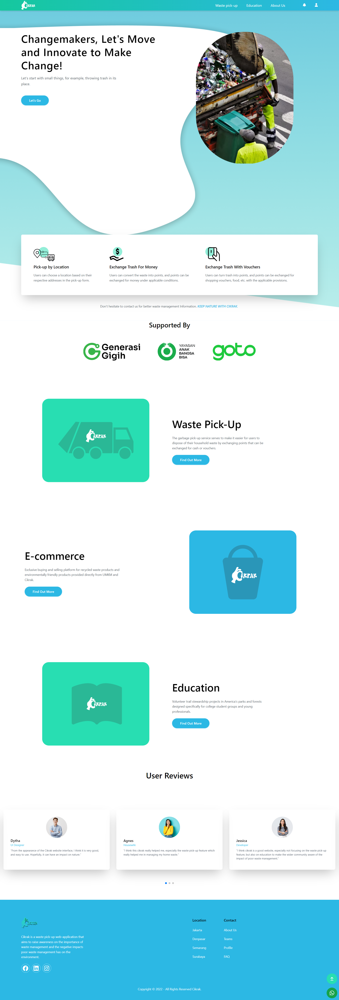

# Cikrak

> Cikrak is a waste pick-up web-application that aims to raise awareness on the importance of waste management and the negative impacts poor waste management has on the environment.



## Features

- Register
- Login
- See user profile
- Edit user profile
- Reedem Points / Browse vouchers
- See history transaction
- Change Password
- Waste Pick-up
- Choose Payment Method
- Waste Education

## Powered by

- [Create React App](https://create-react-app.dev/) to initialize the project.
- [React Redux](https://react-redux.js.org/) to manage the app state.
- [Tailwindcss](https://tailwindcss.com/docs/installation) + [React Icons](https://react-icons.github.io/react-icons/) + [Swiper](https://swiperjs.com/) + [react-hot-toast](https://react-hot-toast.com/) to build the user interface.
- [Jest](https://jestjs.io/) & [react testing-library](https://testing-library.com/) to test the UI Components and implementation.
- [Vercel](https://vercel.com/) to hosted website.

## How to run on local

- Clone this project

  ```bash
  git clone https://github.com/azaf123/cikrak-project.git
  ```

- Go to the project folder

  ```bash
  cd cikrak-project
  ```

- Install dependencies

  ```bash
  npm install
  ```

- Run the server

  ```bash
  npm start
  ```

- Open <http://localhost:3000> with your browser to see the result.

## How to use

Use the following dummy data to login:

- Create an account by clicking “Get Started” and then sign up.
- Login using details inputted during sign up.
- Access all the available features 😊
